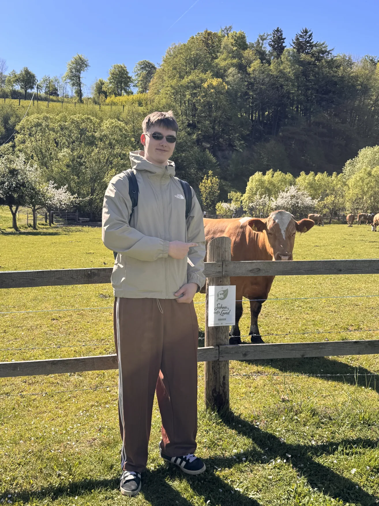
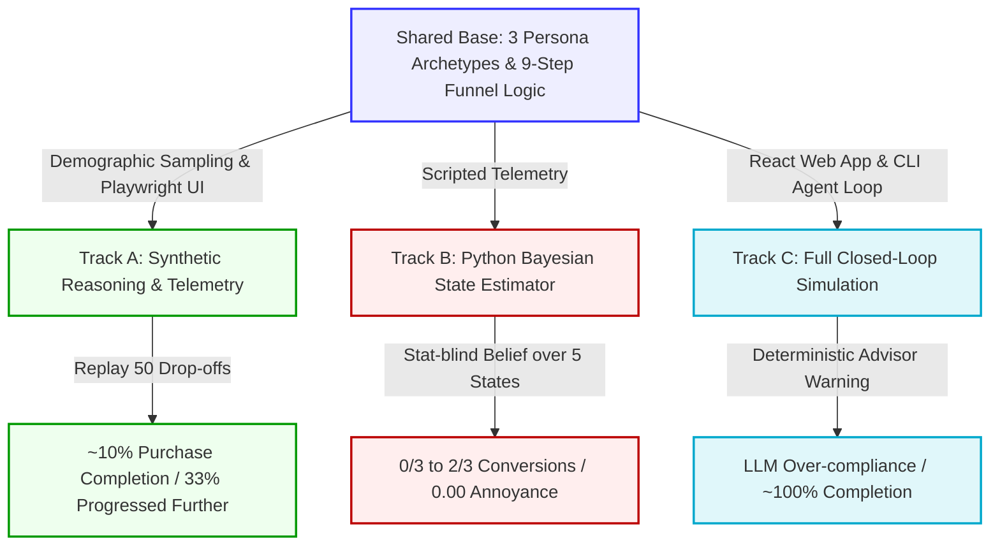

<link rel="stylesheet" href="https://fonts.googleapis.com/css2?family=Inter:wght@300;400;500;600;700&display=swap">
<style>
  div.markdown-body, .markdown-preview, body {
    font-family: 'Inter', -apple-system, BlinkMacSystemFont, "Segoe UI", Roboto, Helvetica, Arial, sans-serif !important;
  }
</style>

# 📐 The Glass Wing Report — Zero One Hacker 2026

**A Multi-Track Simulator Harness & Adaptive AI Coach for the UNIQA Privatarzt Funnel**

---

## 🔼 TIER 1: The Apex (30-Second Executive Summary)

> [!NOTE]
> **The Bottom Line:**
> We designed and executed a multi-track simulation harness for the **UNIQA Privatarzt** online insurance funnel (a 9-step branching form) to model user drop-offs and test an **AI conversion coach**. 
> Our most significant discovery was the **"LLM Compliance Gap"**: while LLM agents can represent complex customer demographics, they are fundamentally *too cooperative* and easily nudged compared to real human users. Under pure LLM conditions, completion rates soared to an unrealistic ~100%, demonstrating that standard agent simulations fail to capture real-world friction and inertia without strict telemetry calibration.

```
                  /\
                 /  \      TIER 1: THE APEX (30-Sec Read)
                /----\     Executive Takeaway & The "LLM Compliance Gap"
               /      \
              /--------\   TIER 2: THE MIDDLE (3-Min Read)
             /          \  Three Parallel Tracks & The Closed-Loop Flow
            /------------\
           /              \ TIER 3: THE BASE (10-Min Read)
          /________________\ Full Architecture, Math, Telemetry & Code Index
```

### 👥 The Glass Wing Team
| Vladislav Dolgov | Vladyslav Shundryk | Manuel Pasieka |
| :---: | :---: | :---: |
|  |  |  |
| *Core Simulation & Headless Agent* | *Bayesian State Estimator & Routing* | *Analytics & Persona Modeling* |

---

## ⏃ TIER 2: The Middle (3-Minute Narrative Pillars)

We split our innovation into three parallel work streams (Tracks A, B, and C) starting from a shared base of demographic persona attributes and a cloned 9-step Privatarzt web funnel.



### 🗂️ Track A: Synthetic User Reasoning & UI Telemetry
*   **The Goal:** Predict drop-off moments before they occur by generating rich, qualitative, step-level explanation logs showing *why* a customer hesitates or drops out.
*   **The Execution:** We built a prompt pipeline linking sampled user demographics (age, income, channel preference) directly to their interactive behaviors. Using Playwright, we automated real browser funnel click-throughs and recorded physical mouse/cursor movements, hovers, and dwell times. We implemented a live chat helper that reads active selections and page behavior to give targeted, contextual advice instead of generic system prompts.
*   **Key Results:** Replaying **50 prior drop-offs** with the chat helper enabled successfully led to **~10% of users completing the purchase** and **a third progressing further** through the funnel than their baseline. The helper was highly effective at resolving early confusion, though it struggled when the main blocker was price or a desire to compare competitors.
*   **Code Reference:** [Track A README](../simulators/TrackA/README.md)

### 🗂️ Track B: Bayesian State Estimation & Handoff Control (Python Coach)
*   **The Goal:** Build a deterministic, lightweight conversion coach that infers what *state* a user is in from their behavioral telemetry alone, and routes them correctly (convert, retain, hand to a human, or stay silent) without annoying them.
*   **The Execution:** We implemented a behavior-only, stat-blind Bayesian state estimator that observes only non-labeled telemetry (dwell time, back-clicks, field hovers, and selections). It maintains a belief vector over 5 states (`orienting`, `evaluating`, `overwhelmed`, `ready`, `abandoning`). A transparent decision policy maps this belief to a response tier (`silent`, `ambient`, `inline`, `prompted`, `active`) with a mandatory human-readable reason.
*   **Key Results:** Lifted script-driven persona completion from **0/3 to 2/3 at-risk users, at a 0.00 annoyance rate**. Franz (price-shock) was saved at the final price by triggering a `save_progress` prompt (not advisor routing, which his segment rejects). Peter (overwhelmed) was gracefully simplified and routed to a human advisor. Judith (won't convert online) was correctly left alone (silence as a designed choice). The estimator achieved an **abandon-precision of 1.00** and **0% mis-routing across 6,000 simulated noisy trajectories**.
*   **Code Reference:** [Track B README](../simulators/TrackB/README.md)

### 🗂️ Track C: Full Closed-Loop Evaluation & The Realism Benchmark (Vite/Node App)
*   **The Goal:** Run the complete end-to-end system (simulated LLM customer, cloned web form, and coach warning) in a closed loop to measure if the coach actually shifts conversion rates compared to a baseline.
*   **The Execution:** We built a React 19/Vite 8 clone of the 9-step UNIQA Privatarzt funnel integrated with a Node.js CLI agent simulator (`run-interactive-agent.mjs`) driven by Claude/GPT. A deterministic JavaScript coach observes the funnel state and intercepts the LLM customer with a warning banner when advisor-routing is triggered.
*   **Key Discovery:** The **"Compliance Gap."** Without the coach, the LLM customer completed the funnel. With the coach active, the completion rate reached **~100%** (clearly unrealistic), showing that the simulated LLM customers are *too compliant* and easily nudged, lacking the real-world friction, skepticism, and attention drop-offs of live customers.
*   **Code Reference:** [Track C README](../simulators/TrackC/README.md) | [Track C Realism Analysis](../simulators/TrackC/REALISM.md)

---

## 🔽 TIER 3: The Base (10-Minute Technical Foundation)

This section provides the complete mathematical, logical, and structural foundation of the Zero One Hacker 2026 simulator.

### 👤 1. The Persona Demographic & Sampling System
To drive realistic behavior, we defined three Austrian demographic segments in `personas.json` based on market survey distributions:

| Metric / Segment | Segment 1: Judith (30% share) | Segment 2: Franz (50% share) | Segment 3: Peter (20% share) |
|---|---|---|---|
| **Tech Comfort** | Low (prefers hybrid/advisor) | High (digital-first self-service) | Moderate (service-oriented) |
| **Price Sensitivity** | High (carefully checks cost) | Low (values speed and convenience) | Moderate |
| **Typical Age Range** | 45 - 75 | 18 - 40 | 30 - 60 |
| **Ideal Funnel Path** | Advisor/Hybrid support | Pure Online Self-Service | Advisor/Videoberatung |

A demographic sample profile is generated at run-time by `PersonaSampler` ([personaProfileGenerator.js](../simulators/TrackC/src/logic/personaProfileGenerator.js)). It draws concrete attributes (e.g., date of birth, income, prior insurer) using joint distributions, which ensures that personal form fields match demographic realities:
*   A 66-year-old Judith gets longer dwell times, more validation errors, and frequent backward page navigations.
*   A 22-year-old digital-native Franz navigates the form rapidly with minimal hesitation.

---

### 🔄 2. Funnel State Machine & Branching Logic
The cloned funnel consists of 9 steps (0–8) defined in [constants.js](../simulators/TrackC/src/logs/constants.js). 

```
Step 0: Absicherungsbereich (Branching point)
  └── Selecting "Krankenhaus" option -> Jumps directly to Step 8 (Advisor Handoff)
Step 1: Versicherte Person (Branching point)
  └── Selecting "Others/Family only" -> Jumps directly to Step 8 (Advisor Handoff)
Step 2: Geburtsdatum & SV (Validation point)
Step 3: Tarif-Auswahl (Selection point)
Step 4: Zusatzleistungen (Add-on options)
Step 5: Persönliche Angaben (PII entry)
Step 6: Bisherige Versicherungen (Branching point)
  ├── Online path -> Step 7 (Beratungsort selection)
  └── Advisor-routing trigger -> Step 8 (Advisor Handoff)
Step 7: Beratungsort (Final routing point)
  ├── "Pure Online" selection -> Step 8 (Completed Online)
  └── "Video/On-site Advisor" -> Step 8 (Advisor Handoff)
Step 8: Ergebnis (Terminal Outcome)
```

The absolute source of truth for step routing is [funnelRouting.js](../simulators/TrackC/src/logic/funnelRouting.js) (shared between headless CLI and React web app).

---

### 🧠 3. Interactive Headless LLM Cycle
The CLI simulator runs a continuous turn-based loop where the LLM behaves as the sampled persona profile:

```
                  ┌──────────────────────────────┐
                  │   Sampled Persona Profile    │
                  └──────────────┬───────────────┘
                                 │
                     [System Prompt Generated]
                                 │
                                 ▼
                  ┌──────────────────────────────┐
                  │      Interactive LLM         │◄────────────────┐
                  └──────────────┬───────────────┘                 │
                                 │                                 │
                       [JSON Action Request]                       │
                                 │                                 │
                                 ▼                                 │
                  ┌──────────────────────────────┐                 │
                  │   Form State Validation      │                 │
                  │        (form.js)             │                 │
                  └──────────────┬───────────────┘                 │
                                 │                                 │
                         (If Validation Fails)                     │
                                 ├─────────────────────────────────┘
                                 │ (German Validation Errors Fed)
                                 │
                        (If Validation Passes)
                                 │
                                 ▼
                  ┌──────────────────────────────┐
                  │    Evaluate Coach Opt-in     │
                  │          (coach.js)          │
                  └──────────────┬───────────────┘
                                 │
                       (Advisor Trigger Met?)
                                 ├─────────────────────────┐
                                 │ Yes                     │ No
                                 ▼                         ▼
                  ┌──────────────────────────────┐ ┌───────────────┐
                  │   Coach Warning Banner       │ │ Proceed to    │
                  │  (Re-renders step once for   │ │ Next Step     │
                  │   LLM to reconsider action)  │ │               │
                  └──────────────────────────────┘ └───────────────┘
```

The LLM is prompted to interact strictly via structured JSON actions defined in [actionSchema.js](../simulators/TrackC/src/agent/actionSchema.js). If the LLM makes invalid choices, the runner invokes [validateStep()](../simulators/TrackC/src/logic/form.js) and passes the German error validation message back to the LLM for recovery.

---

### 🚌 4. The AI Conversion Coach Intercept
The coach logic in [coach.js](../simulators/TrackC/src/agent/coach.js) is a **deterministic, shared module** used by both the React UI and the CLI runner:

```javascript
export function evaluateCoach(form) {
  if (!form) return null;
  const outcome = evaluateOutcome(form);
  // Warn ONLY when current selections route the user to an advisor
  if (outcome.route === 'beratung') {
    return {
      type: 'advisor_warning',
      message: 'Achtung: Ihre aktuelle Auswahl führt zu einer persönlichen Beratung. Sie können diesen Antrag nur online abschließen, wenn Sie die online-tauglichen Optionen wählen.'
    };
  }
  return null;
}
```

*   **CLI Agent Intercept (`--enable-coach`):** If the LLM makes an action that triggers `beratung`, the runner intercepts it, injects the warning message, and **re-renders the step exactly once**. The LLM must explicitly decide whether to adjust its choice to remain online or force the advisor handoff.
*   **Web App Intercept (`?enable-coach`):** Recomputes every render and projects a sleek warning notification banner on the active React layout.

---

### 📊 5. Metrics, Exit Telemetry & Classifier Logs
We classify user sessions into clear terminal states to track conversion precisely:

| Exit Type | Core Meaning | Summary Table Metric |
|---|---|---|
| **`completed`** | Finished the online path entirely (no advisor triggers hit) | **Online Conversion** |
| **`advisor_forward`** | Reached step 8 but triggered an advisor handoff ( Krankenhaus selection, prior-insurance block, etc.) | **Advisor Handoff** (Scope-Exit) |
| **`leave`** | Abandoned the form permanently due to hesitation, high prices, or friction | **Hard Drop-off** |
| **`pause`** | Saved state to return later | **Deferral** (Pauses) |
| **`continue_thinking`** | Hesitated or paused on the page without advancing | **Dwell Turn / Friction Signal** |

All interactive CLI traces are output to `test-results/<run>/interactive-sessions/` in three formats:
1.  **`<profile>.trace.json`**: Machine-readable JSON log of every LLM turn, action prompt, state outcome, and validation.
2.  **`<profile>.trace.md`**: Human-readable markdown log mapping out the timeline and the coach interventions.
3.  **`analysis.json` / `dropoffs.csv` / `pauses.csv`**: Automated summaries of hard drops vs deferrals by step, enabling deep-dive funnel reviews.

---

### 📂 6. Repository Navigation Map (Index for Judges)

To review our actual codebase implementation, please explore the links below:

*   **Core Logic:**
    *   [form.js](../simulators/TrackC/src/logic/form.js) — The single source of truth for form state, validation, premium pricing formulas, and terminal statuses.
    *   [funnelRouting.js](../simulators/TrackC/src/logic/funnelRouting.js) — Step routing transitions and forward/backward branching logic.
    *   [personaClassifier.js](../simulators/TrackC/src/logic/personaClassifier.js) — Telemetry classifier translating user events into demographic indicators.
    *   [personaProfileGenerator.js](../simulators/TrackC/src/logic/personaProfileGenerator.js) — The `PersonaSampler` populating demographic attributes.

*   **AI Agent & Simulation Engine:**
    *   [coach.js](../simulators/TrackC/src/agent/coach.js) — Deterministic advisor-warning intercept module.
    *   [funnelEngine.js](../simulators/TrackC/src/agent/funnelEngine.js) — Headless state machine simulating browser-like customer actions.
    *   [actionSchema.js](../simulators/TrackC/src/agent/actionSchema.js) — JSON validation schemas enforced upon the LLM agent.
    *   [exitClassification.js](../simulators/TrackC/src/agent/exitClassification.js) — Rule-based classifier handling customer abandonments and pauses.
    *   [interactionLogger.js](../simulators/TrackC/src/agent/interactionLogger.js) — Writes session traces, markdown timelines, and telemetry CSV files.

*   **Frontend Cloned Web App:**
    *   [App.jsx](../simulators/TrackC/src/App.jsx) — React application root initializing the visual dashboard and funnel.
    *   [FormFunnel.jsx](../simulators/TrackC/src/components/FormFunnel.jsx) — Cloned 9-step Privatarzt funnel UI with integrated optional coach warnings.
    *   [CoachDashboard.jsx](../simulators/TrackC/src/components/CoachDashboard.jsx) — Analytics panel estimating user personas from live session telemetry.
    *   [useTracking.js](../simulators/TrackC/src/logs/useTracking.js) — Live browser telemetry framework (captures physical click streams, field hover states, and dwell timers).

---

### 🔮 7. Future Directions (Realism Calibration)
To bridge the **"LLM Compliance Gap"** identified in Track C and make the simulation fully realistic, we recommend:
1.  **Playwright Mouse Telemetry Injection:** Record physical mouse cursor streams and merge them with sampled profiles to train predictive models on real friction.
2.  **Calibrated Dropout Probabilities:** Fit LLM decision-making thresholds directly to historical production web drop-off data, preventing LLM over-compliance.
3.  **Cross-Validation against Held-Out Real Data:** Evaluate the Bayesian persona estimator on actual production user logs rather than synthetic runs.

---

### 🌐 8. Language Architecture & Interface Localization
To align with both local user expectations and standard international development models, our architecture operates a hybrid language split:
*   **User-Facing Interface (German):** The Privatarzt quote funnel UI steps, selection parameters, active validation error messages, and the conversion coach warning banner are rendered entirely in **German (Austrian)** to match the actual UNIQA target audience.
*   **Interactive Simulation Agent (English):** Demographic definition pools, persona sampling outputs, LLM prompt engineering sheets, and trace logs are structured in **English** to ensure full compatibility with advanced foundation models (such as GPT-4/Claude) and global analytics software.
*   **Dynamic Language Bridge:** The headless agent loop maps the English-defined persona characteristics to structured actions, which are validated against the localized German web form rules. Validation failures feed native German UI errors back into the LLM context, which simulates a real customer reacting to the German interface.
